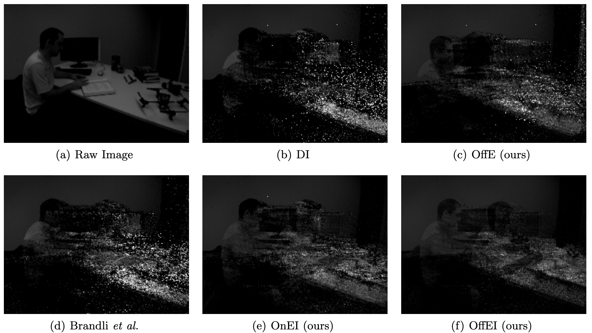

# Event Camera Calibration of Per-pixel Biased Contrast Threshold
## For academic use only

  

Event cameras output asynchronous events to represent intensity changes with a high temporal resolution, even under extreme lighting conditions. Currently, most of the existing works use a single contrast threshold to estimate the intensity change of all pixels. However, complex circuit bias and manufacturing imperfections cause biased pixels and mismatch contrast threshold among pixels, which may lead to undesirable outputs. In this paper, we propose a new event camera model and two calibration approaches which cover event-only cameras and hybrid image-event cameras. When intensity images are simultaneously provided along with events, we also propose an efficient online method to calibrate event cameras that adapts to time-varying event rates. We demonstrate the advantages of our proposed methods compared to the state-of-the-art on several different event camera datasets.

Ziwei Wang, Yonhon Ng, Pieter van Goor, Robert Mahony

The paper was accepted by the Australasian Conf. Robotics and Automation (ACRA 2019) in Adelaide, Australia.
[[Paper]](https://ssl.linklings.net/conferences/acra/acra2019_proceedings/views/includes/files/pap135s1-file1.pdf)
[[arXiv]](https://arxiv.org/pdf/2012.09378.pdf)
[[Data]](https://drive.google.com/drive/folders/14BF-1fkNsGoPodG1v4qH1W3K-Lixgp4K?usp=sharing)

## Citation
If you use or discuss our paper, please cite as follows:
<pre>
@InProceedings{wang19acra,
	author        = {Wang, Ziwei and Ng, Yonhon and van Goor, Pieter and Mahony, Robert},
	title         = {Event Camera Calibration of Per-pixel Biased Contrast
	Threshold},
	booktitle     = {Australasian Conference of Robotics and Automation (ACRA)},
	year          = 2019
}
</pre>

## Code
Run [`EventFrameCalib.m`](https://github.com/ziweiWWANG/Event-Camera-Calibration/blob/master/EventFrameCalib.m). It will load event data from `./data` and calibrate the selected dataset using both event and frame data. 

Run [`EventOnlyCalib.m`](https://github.com/ziweiWWANG/Event-Camera-Calibration/blob/master/EventOnlyCalib.m). It will load event data from `./data` and calibrate the selected dataset using only event data.
The calibrated parameters will be save in `./results/{DATASET}/{METHOD}/scale.csv` and `./results/{DATASET}/{METHOD}/bias.csv`.

Run [`ImageReconstruction.m`](https://github.com/ziweiWWANG/Event-Camera-Calibration/blob/master/ImageReconstruction.m). It will load events and frames from `./data` and the calibrated parameters from `./results/{DATASET}/{METHOD}/' and then generate event reconstructions by integrating 500k events from images.

## Prepare data
### Example dataset
Download the dataset and save to folder `./data`
- [Click Here to Download Example Datasets](https://drive.google.com/drive/folders/14BF-1fkNsGoPodG1v4qH1W3K-Lixgp4K?usp=sharing).

Dataset from: [[Mueggler et al., IJRR 2017]](https://rpg.ifi.uzh.ch/davis_data.html)

### How to prepare a good calibration dataset for your event camera
If you want to calibrate your camera or other datasets, choose a data sequence with normal lighting conditions and slow motion for better calibration performance. 
The scene should contain rich textures that can trigger enough events for all pixels.
An easy example you can try is the provided dataset `box_translation`. The data contains motion from slow to very fast. The intensity frames are very blurry when the camera moves too fast. 
Calibration using only frames 1-200 provides better evaluation performance than using the whole sequence for both [`EventFrameCalib`](https://github.com/ziweiWWANG/Event-Camera-Calibration/blob/master/EventFrameCalib.m) and [`EventOnlyCalib`](https://github.com/ziweiWWANG/Event-Camera-Calibration/blob/master/EventOnlyCalib.m).

For pure event calibration, the scene should be roughly equally textured, such that the excitation of each pixel is similar, which aligns with the assumption in Section 4.3 of the paper.

### Code to pre-process your event sequence 
Change the dataset path and run [`GenSumESumP.m`](https://github.com/ziweiWWANG/Event-Camera-Calibration/blob/master/GenSumESumP.m). It will load your event data and frame timestamps from `./data` and save `sumE` (sum of event count between each frame timestamp) and `sumP` (sum of polarity between each frame timestamp) locally. They are inputs for both [`EventFrameCalib.m`](https://github.com/ziweiWWANG/Event-Camera-Calibration/blob/master/EventFrameCalib.m) and [`EventOnlyCalib.m`](https://github.com/ziweiWWANG/Event-Camera-Calibration/blob/master/EventOnlyCalib.m).

## Log safety offset
The log safety offset used in the code measures the zero-level offset between events and frames. 
The event-frame calibration method computes event scale and bias to match events and frames with a custom-defined log safety offset. 
Choose this parameter for different datasets carefully and make sure the corresponding log safety offset used in evaluation ([`ImageReconstruction.m`](https://github.com/ziweiWWANG/Event-Camera-Calibration/blob/master/ImageReconstruction.m)) is the same as the one used in event-frame calibration ([`EventFrameCalib.m`](https://github.com/ziweiWWANG/Event-Camera-Calibration/blob/master/EventFrameCalib.m)).

The pure event calibration method is designed for event cameras or datasets without registered frame references. 
It calibrates event data (e.g., hot pixels) but does not match events with any frames (since there is no frame as input!), and of course no log safety offset is used in [`EventOnlyCalib.m`](https://github.com/ziweiWWANG/Event-Camera-Calibration/blob/master/EventOnlyCalib.m). 
When evaluating the performance using the provided example dataset and evaluation method (integrate event to frames and compare with frames ground-truth), different log safety offsets used in [`ImageReconstruction.m`](https://github.com/ziweiWWANG/Event-Camera-Calibration/blob/master/ImageReconstruction.m) would generate very different reconstructions.
For example, log safety offset = 90 leads to much better RMSE/PSNR/SSIM/visual reconstruction than log safety offset = 40 using the same event-only calibration parameters.
However, compared to no calibration, our calibration always improves the evaluation performance, even using different log safety offsets.

## Notes 
1. [Brandliet al., 2014] Christian Brandli, Lorenz Muller,and Tobi Delbruck.  Real-time,  high-speed video de-compression using a frame-and event-based davis sensor.  In 2014  IEEE  International  Symposium  on  Circuits  and  Systems  (ISCAS),  pages  686–689.  IEEE,2014.
2. Should you have any questions regarding this paper, please contact ziwei.wang1@anu.edu.au

